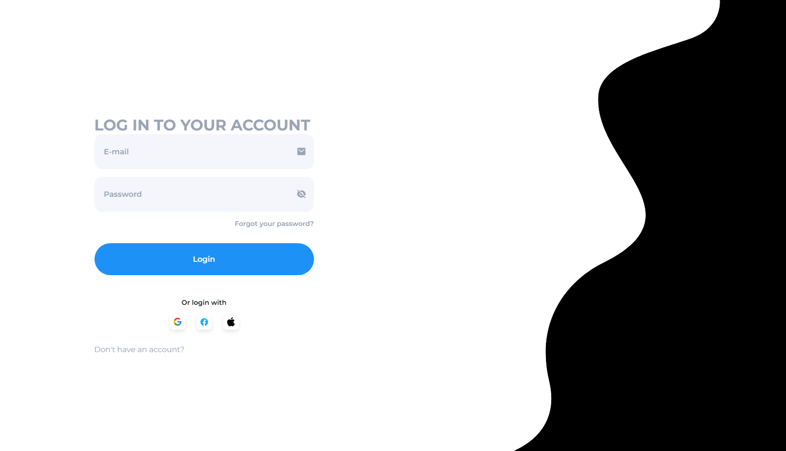

<h3>Tela de Login Responsiva </h3>

Este repositório contém uma tela de login desenvolvida utilizando HTML, CSS, SCSS e JavaScript. O design é totalmente responsivo, garantindo uma boa experiência de usuário em dispositivos móveis e desktop. A tela de login foi criada para ser simples, funcional e fácil de integrar em projetos web.

<h4>Tecnologias utilizadas: </h4>

HTML5
CSS3
SCSS (Sass)
JavaScript (Vanilla)
Funcionalidades:

Layout responsivo
Validação de formulário em JavaScript
Personalização de estilos com SCSS
Este projeto pode ser utilizado como base para interfaces de login em outros sistemas ou adaptado conforme necessário.

<h3>Responsive Login Screen</h3>
This repository contains a login screen developed using HTML, CSS, SCSS, and JavaScript. The design is fully responsive, ensuring a good user experience on both mobile devices and desktop. The login screen was created to be simple, functional, and easy to integrate into web projects.

<h2>Technologies Used:</h2>
HTML5
CSS3
SCSS (Sass)
JavaScript (Vanilla)

<h4>Features:</h4>
Responsive layout
Form validation in JavaScript
Style customization with SCSS
This project can be used as a base for login interfaces in other systems or adapted as needed.
